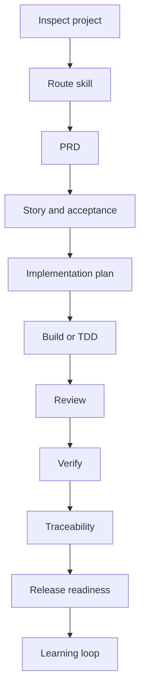

# Workflow Graph

```mermaid
flowchart TD
  Inspect["Inspect project"]
  Route["Route skill"]
  PRD["PRD"]
  Story["Story and acceptance"]
  Plan["Implementation plan"]
  Build["Build or TDD"]
  Review["Review"]
  Verify["Verify"]
  Trace["Traceability"]
  Release["Release readiness"]
  Learn["Learning loop"]

  Inspect --> Route --> PRD --> Story --> Plan --> Build --> Review --> Verify --> Trace --> Release --> Learn
```
